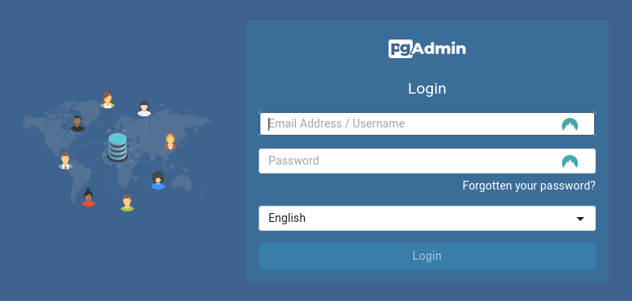

# Pen-Pixel

Pen Pixel is a SpringBoot project to server a simples blog-post.

The main idea is, show a Java project using clean architecture and some tools like a jdbc-template, cache using Redis,
SpringDoc and more.

## Tech Stack

**Built-in:**

* [Maven](https://maven.apache.org/)
* [Spring](https://spring.io/)
* [SpringDoc-OpenApi](https://springdoc.org/)
* [Docker](https://www.docker.com/)
* [Redis](https://redis.io/)
* [Postgres](https://www.postgresql.org/)

## Getting Started

### Pre-requirements

- Docker and Docker-Compose
- JDK 17
- Maven 3


```shell
git clone https://github.com/leoyassuda/pen-pixel.git
```

### Infra Setup

This project is based on Docker to start all dependencies before the application.

In `infra` folder exists all files to set up the development environment.

copy and edit examples `env` files:
```shell
cp .env.example .env
cp .env.pgdb.example .env.pgdb
cp .env.pgadmin.example .env.pgadmin
```

### Database client

Database client:

- pg_admin:
  - A powerful tool to admin Postgres Instances. 
  - to login, see on the `env.pgadmin` file.
  - 

## Running

Installing dependencies and building application.

```shell
make install
```

build app image

```shell
make build-app-image  
```

Starting only infrastructure

```shell
make start-infra
```

To start everything
```shell
make start
```

## API Document

TODO: Describe swagger documentation here

## Utils

Some util commands

#### create image using maven

```shell
mvn spring-boot:build-image -Dspring-boot.build-image.imageName=<docker_hub_user>/<repo>
```

#### push image

```shell
docker push leoyassuda/pen-pixel-app
```

#### inspect using JQ

```shell
docker network inspect infra_bridge-petwork | jq '.[0].IPAM.Config[0].Gateway'
```

#### export DB Ip Connection

```shell
export DB_CONNECTION_IP=$(docker network inspect infra_bridge-petwork | jq -r '.[0].IPAM.Config[0].Gateway')
```

---

## Authors

- **Leo Yassuda** - _Initial work_ - [Portfolio](https://leoyas.com)
